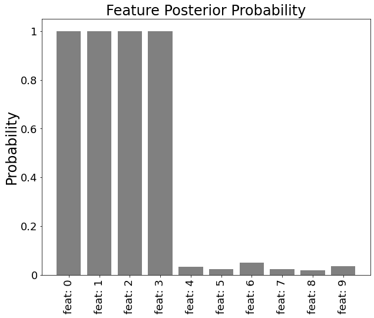
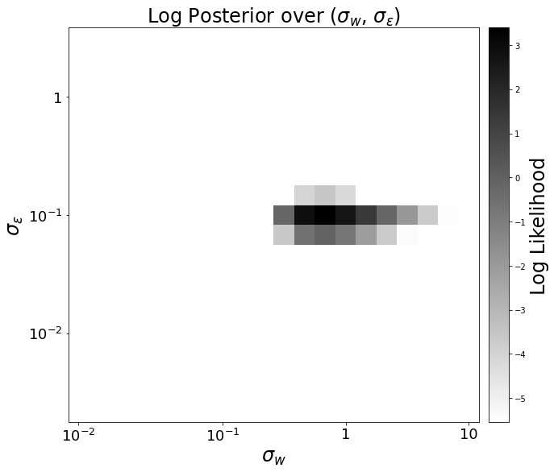
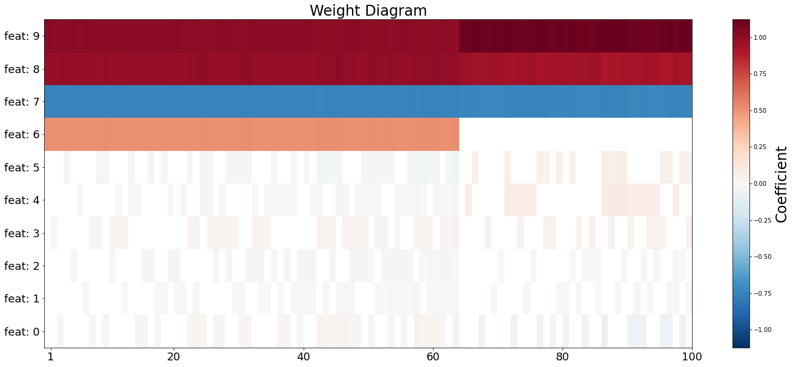

=============================
ExhBMA with Linear Regression
=============================

Apply ExhBMA with linear regression model.
The number of features is restricted to under around twenty to perform an exhaustive search.

Generate sample dataset
=======================

We consider a linear model :math:`y = x_1 + x_2 - 0.8 x_3 + 0.5 x_4 + \epsilon` for a toy generative model.
Noise vaiable :math:`\epsilon` follows the normal distribution with a mean of 0 and a variance of 0.1.

We add dummy features and prepare ten features in total.
The number of observed data is 50.

.. code:: python

   import numpy as np

   n_data, n_features = 50, 10
   sigma_noise = 0.1

   nonzero_w = [1, 1, -0.8, 0.5]
   w = nonzero_w + [0] * (n_features - len(nonzero_w))

   np.random.seed(0)
   X = np.random.randn(n_data, n_features)
   y = np.dot(X, w) + sigma_noise * np.random.randn(n_data)

Train a model
=============

First, training data should be preprocessed with centering and normalizing operation.
Normalization for target variable is optional and is not performed
in a below example (:code:`scaling=False` is passed for :code:`y_scaler`).

.. code:: python

   from exhbma import ExhaustiveLinearRegression, inverse, StandardScaler

   x_scaler = StandardScaler(n_dim=2)
   y_scaler = StandardScaler(n_dim=1, scaling=False)
   x_scaler.fit(X)
   y_scaler.fit(y)
   X = x_scaler.transform(X)
   y = y_scaler.transform(y)

For constructing an estimator model, prior distribution parameters for :math:`\sigma_{\text{noise}}`
and :math:`\sigma_{\text{coef}}` need to be specified.
You need to specify discrete points for the x-inverse distribution and
these points are used for numerical integration (marginalization over
:math:`\sigma_{\text{noise}}` and :math:`\sigma_{\text{coef}}`).

Fit process will finish within a minute.

.. code:: python

   # Settings of prior distributions for sigma_noise and sigma_coef
   n_sigma_points = 20
   sigma_noise_log_range = [-2.5, 0.5]
   sigma_coef_log_range = [-2, 1]

   # Model fitting
   reg = ExhaustiveLinearRegression(
       sigma_noise_points=inverse(
           np.logspace(sigma_noise_log_range[0], sigma_noise_log_range[1], n_sigma_points),
       ),
       sigma_coef_points=inverse(
           np.logspace(sigma_coef_log_range[0], sigma_coef_log_range[1], n_sigma_points),
       ),
   )
   reg.fit(X, y)

Results
=======

First, we import plot utility functions and prepare names for features.

.. code:: python

   from exhbma import feature_posterior, sigma_posterior

   columns = [f"feat: {i}" for i in range(n_features)]

Feature posterior
-----------------

Posterior probability that each feature is included in the model is estimated.

You can access the values of posterior probability by :code:`reg.feature_posteriors_`.

.. code:: python

   fig, ax = feature_posterior(
       model=reg,
       title="Feature Posterior Probability",
       ylabel="Probability",
       xticklabels=columns,
   )

Probabilities for features with nonzero coefficient are close to 1,
which indicate that we can select first four features with high confidence.
On the other hand, probabilities for dummy features are close to 0.

Sigma posterior distribution
----------------------------

To confirm that defined range of prior distributions properly
contains a peak of posterior distribution, plot the posterior distribution
of hyperparameters :math:`\sigma_{\text{noise}}` and :math:`\sigma_{\text{coef}}`.

.. code:: python

   fig, ax = sigma_posterior(
       model=reg,
       title="Log Posterior over ($\sigma_{w}$, $\sigma_{\epsilon}$)",
       xlabel="$\sigma_{w}$",
       ylabel="$\sigma_{\epsilon}$",
       cbarlabel="Log Likelihood",
   )

Peak of the distribution is near the :math:`(\sigma_{\text{noise}}, \sigma_{\text{coef}}) = (0.1, 0.8)`,
which is close to the predefined values.

Coefficients
------------

Coefficient values estimated by BMA is stored in `ExhaustiveLinearRegression.coef_` attribute.

.. code:: python

   for i, c in enumerate(reg.coef_):
       print(f"Coefficient of feature {i}: {c:.4f}")

Output

.. code:: console

   Coefficient of feature 0: 1.0072
   Coefficient of feature 1: 0.9766
   Coefficient of feature 2: -0.7500
   Coefficient of feature 3: 0.5116
   Coefficient of feature 4: -0.0006
   Coefficient of feature 5: -0.0002
   Coefficient of feature 6: 0.0012
   Coefficient of feature 7: 0.0003
   Coefficient of feature 8: -0.0000
   Coefficient of feature 9: 0.0007

Weight Diagram
--------------
For more insights into the model, weight diagram [#weight-diagram]_ is a useful visualization method.

Prediction for new data
=======================

For new data, prediction method is prepared.
First, we prepare test data to evaluate the prediction performance.

.. code:: python

   n_test = 10 ** 3
   np.random.seed(10)
   test_X = np.random.randn(n_test, n_features)
   test_y = np.dot(test_X, w) + sigma_noise * np.random.randn(n_test)

For prediction, we use `predict` method.
Note that data transformation is necessary for feature data and predicted data.

.. code:: python

   pred_y = y_scaler.restore(
       reg.predict(x_scaler.transform(test_X), mode="full")
   )

For performance evaluation, we calculate root mean squared error (RMSE).

.. code:: python

   rmse = np.power(test_y - pred_y, 2).mean() ** 0.5
   print(f"RMSE for test data: {rmse:.4f}")

Output

.. code:: console

   RMSE for test data: 0.1029

RMSE value is close to the predefined noise magnitude, so the estimation is successfully performed.

.. rubric:: References

.. [#weight-diagram] `Y. Igarashi et al., ES-DoS: Exhaustive search and density-of-states estimation as a general framework for sparse variable selection, 2018 <https://iopscience.iop.org/article/10.1088/1742-6596/1036/1/012001>`_
